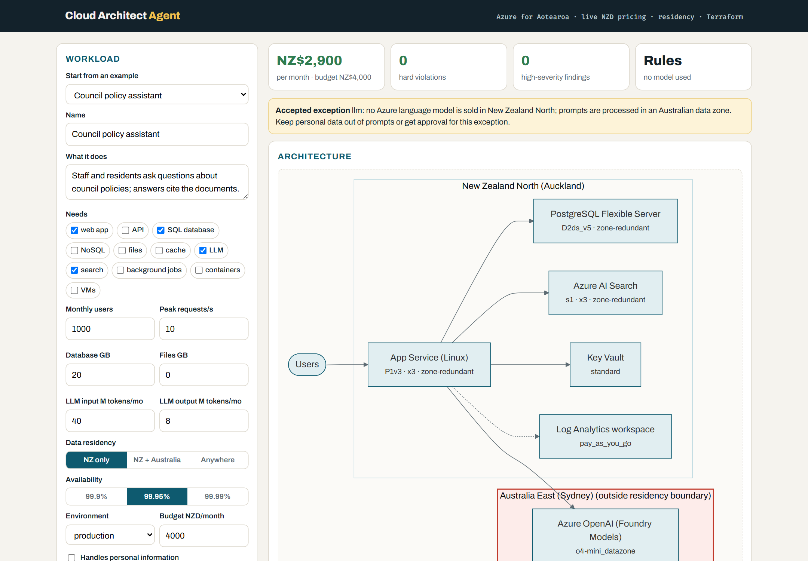
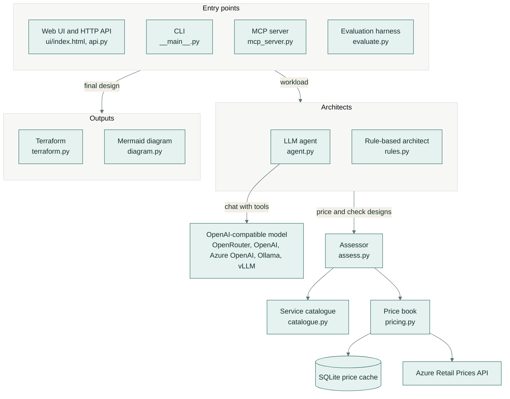
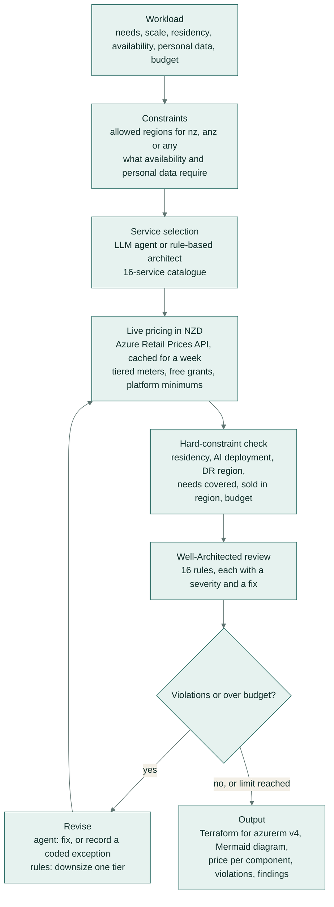
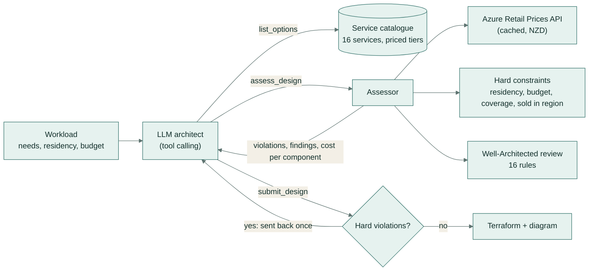
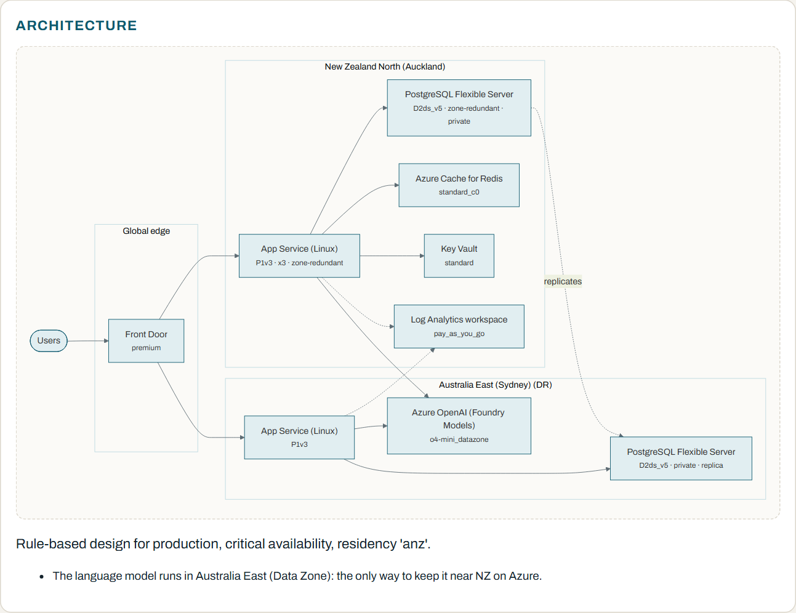
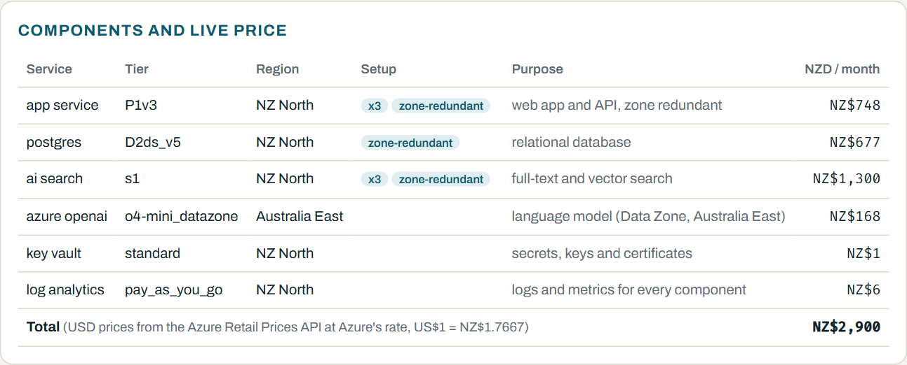
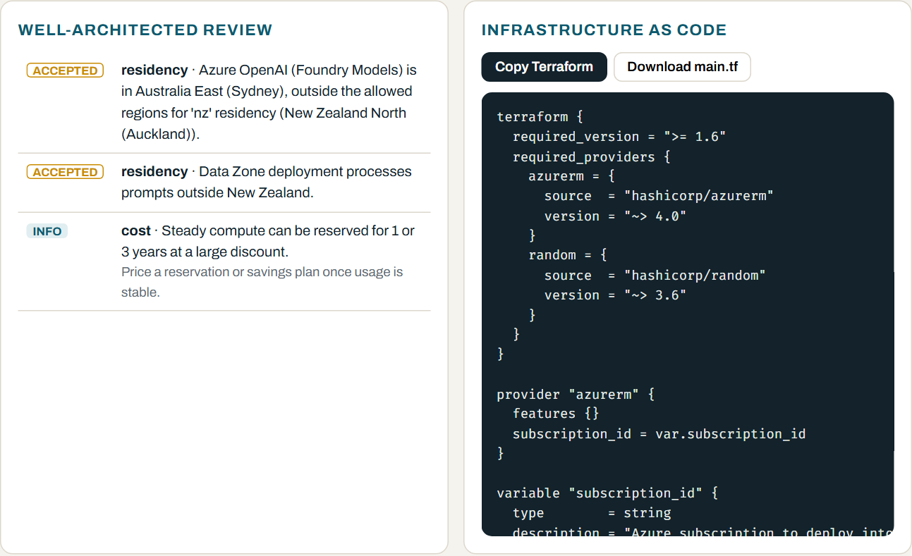

# Cloud Architect Agent

An LLM agent that designs Azure architectures for New Zealand organisations. You describe a workload in business terms, and it returns an architecture that is priced live in NZD from the Azure Retail Prices API, kept inside a data-residency boundary (`nz`, `anz` or `any`), reviewed against 16 Well-Architected rules, and delivered as Terraform for `azurerm` v4 with a Mermaid diagram. It is for architects and platform teams who need a sound first design, and a monthly cost they can defend, for an Azure workload in New Zealand.

[](https://github.com/samiulhuda360/cloud-architect-agent/actions/workflows/ci.yml)




## Key features

- **Live NZD pricing.** Every component is priced from the public Azure Retail Prices API with exact meter recipes, and no Azure account is needed. Tiered meters, free grants and platform minimums are applied. USD is converted to NZD at Azure's own rate.
- **Residency as a hard constraint.**
  - `nz` allows New Zealand North only.
  - `anz` adds Australia East and Australia Southeast.
  - `any` allows all five supported regions.

  Anything that crosses the boundary must be recorded as an exception that names its rule code, such as `[RES-REGION]`.
- **Hard-constraint checks** for:
  - residency;
  - the AI deployment type (Global or Data Zone);
  - the disaster-recovery (DR) region;
  - budget;
  - coverage of every workload need;
  - whether Azure sells the service in that region.
- **A 16-rule Well-Architected review** across reliability, security, cost, operations, performance and residency. Each finding has a severity and a fix.
- **Two architects:**
  - an LLM agent that uses tool calling on any OpenAI-compatible endpoint;
  - a deterministic rule-based architect that needs no model, fits the design to the budget and is the evaluation baseline.
- **Terraform for `azurerm` v4**, with:
  - zone redundancy;
  - private endpoints with private DNS;
  - App Service VNet integration;
  - Front Door with health-probe failover;
  - cross-region database replicas;
  - managed identities and Key Vault.

  The Terraform for all 20 evaluation designs passes `terraform validate` and `terraform fmt`.
- **A Mermaid diagram** with one box per region. Anything outside the residency boundary is drawn in red.
- **Three ways to use it:** a web UI, a CLI, and an MCP server that any MCP-capable assistant or IDE can call.

## Why New Zealand needs its own checks

Azure's New Zealand North region (Auckland) has three availability zones. Its services and prices differ from Australia East (Sydney), and the differences change the design:

- **No Azure OpenAI.** In the Azure Retail Prices API (October 2026), Foundry Models (Azure OpenAI) has no price rows in New Zealand North and 833 in Australia East.
- **62 services are missing in all.** Each is priced in Australia East but not in NZ North, and Foundry Models is one of them. The others include Azure Machine Learning, Databricks, Synapse Analytics, IoT Hub, Bot Service and Sentinel ([snapshot](docs/data/region-services-2026-10.json)).
- **No paired region.** Geo-redundant storage (GRS) is not sold there, and a DR site has to be outside New Zealand.
- **No GPU virtual machines.** A model can't be self-hosted in Auckland either.
- **Different prices.** Most compute costs about 5% more than in Sydney. Some SKUs cost much more, and a few cost less:

| Monthly list price (730 hours) | NZ North | Australia East | Difference |
|---|---|---|---|
| App Service P0v3 (Linux), 1 instance | NZ$162 | NZ$119 | **+37%** |
| App Service P1v3 (Linux), 1 instance | NZ$249 | NZ$237 | +5% |
| VM D2s v5 (Linux) | NZ$163 | NZ$155 | +5% |
| PostgreSQL Flexible D2ds v5 (compute) | NZ$330 | NZ$315 | +5% |
| Azure SQL General Purpose, 2 vCores (compute) | NZ$491 | NZ$467 | +5% |
| Azure Cache for Redis Standard C1 | NZ$178 | NZ$178 | 0% |
| Azure AI Search Basic | NZ$130 | NZ$172 | **-24%** |

*USD list prices from the Azure Retail Prices API, converted at Azure's own rate (US$1 = NZ$1.7667).*

Prices and regional availability change over time, so nothing is taken from memory. Every design is priced and checked against live price data. Anything that crosses the residency boundary has to be recorded as an explicit exception.

## Architecture



- **Who designs.** The web UI, the CLI and the evaluation harness send a workload to one of the two architects. Only the LLM agent calls a model.
- **Who judges.** Both architects are judged by the same deterministic assessor. It prices each component through the price book and checks it against the catalogue.
- **The MCP server** exposes the catalogue, region checks, the assessor, the rule-based architect and the Terraform generator as tools, so the MCP client's own model does the designing.
- **Outputs.** The final design becomes Terraform and a Mermaid diagram. The web UI returns both, and the CLI and the MCP server return the Terraform.

The full reference, with every rule code and price recipe, is in [docs/architecture.md](docs/architecture.md).

## How it works

A design request goes through the same steps whichever architect handles it:



1. **Workload.** A `Workload` (`models.py`) describes:
   - the needs (web app, API, relational or NoSQL database, files, cache, LLM, search, background jobs, containers or VMs);
   - monthly users and peak requests per second;
   - database and file sizes, and LLM tokens per month;
   - residency and the availability target (99.9%, 99.95% or 99.99%);
   - the environment, whether it holds personal information, and a monthly budget in NZD.
2. **Constraints.** Residency fixes the allowed regions. The other requirements follow from the workload:
   - High or critical availability needs zone redundancy.
   - Critical availability also needs a working DR site inside the boundary.
   - Personal data needs private endpoints, and a public web app that handles it needs a web application firewall.
3. **Service selection.** The architect picks services and tiers from the 16-service catalogue (`catalogue.py`). The LLM agent (`agent.py`) does this through tool calls, and the rule-based architect (`rules.py`) through fixed rules.
4. **Live pricing.** The assessor (`assess.py`) prices each component from its recipes. The price book (`pricing.py`) does the work:
   - fetches the matching meters from the Azure Retail Prices API and caches them in SQLite for a week;
   - applies volume tiers, free grants and platform minimums;
   - converts USD to NZD at Azure's rate.

   A service with no price in a region is not sold there.
5. **Hard constraints.** The assessor checks:
   - residency (`RES-REGION`);
   - the AI deployment type (`RES-AI-GLOBAL`, `RES-AI-ZONE`);
   - the DR region (`RES-DR`);
   - coverage (`UNKNOWN`, `REGION`, `NOT-SOLD`, `NEED`);
   - budget (`BUDGET`).

   A residency or budget violation can only be accepted by an exception that names the rule code or the thing it relaxes. Accepted exceptions are always reported.
6. **Well-Architected review.** The 16 rules add findings, each with a severity (high, medium, low or info) and a fix. For example, a design that names a DR region but runs no standby compute or database copy there gets `REL-DR`.
7. **Revise.**
   - The agent fixes what fails, or records an exception when no compliant option exists, and then resubmits. A submission that still has violations is sent back once.
   - The rule-based architect downsizes one tier at a time until the design fits the budget, and records each step in `tradeoffs`.
8. **Output.** The final design is assessed once more.
   - The web API returns the price per component, the violations, the findings, a Mermaid diagram (`diagram.py`) and Terraform (`terraform.py`).
   - The CLI prints the design and review as JSON, and writes `main.tf` when you ask for it.

### The agent loop



The agent is an OpenAI-compatible tool-calling loop of at most 12 steps, with three tools:

- `list_options` returns the catalogue.
- `assess_design` returns the price, the violations, the findings and the cost per component.
- `submit_design` submits the final design.

Its system prompt tells it to:

- price every draft with `assess_design`, and never state a price that did not come from it;
- fix every hard violation and stay within the budget;
- record a residency exception only when no compliant option exists, starting it with the rule code, for example `[RES-REGION] no Azure model is sold in NZ North`;
- address high-severity findings, or explain in `tradeoffs` why not.

The model can be any OpenAI-compatible endpoint with tool calling: OpenRouter (the default), OpenAI, Azure OpenAI, Ollama or vLLM. Rate limits, timeouts and server errors are retried with back-off.

The rule-based architect produces the design instead in three cases:

- no model is configured;
- the agent returns no design;
- the model call fails (web UI only). The UI shows a note when this happens.

## Screenshots

**A critical banking workload** with `anz` residency and a 99.99% target. Front Door Premium with WAF sits in front of a zone-redundant primary in Auckland and a warm standby with a PostgreSQL replica in Sydney.



**The live price breakdown.** It shows each component with its tier, region, setup and monthly price in NZD, and the exchange rate used.



**The review and the Terraform.** Accepted exceptions are badged in the Well-Architected review. You can copy the generated Terraform or download it as `main.tf`.



## Tech stack

| Layer | Technology |
|---|---|
| Language | Python 3.10+ |
| Models and validation | Pydantic |
| LLM access | OpenAI Python SDK, against any OpenAI-compatible endpoint (OpenRouter, OpenAI, Azure OpenAI, Ollama, vLLM) |
| Web | FastAPI and Uvicorn. The UI is a single page of HTML and JavaScript, with Mermaid rendered in the browser. |
| MCP | FastMCP, over stdio |
| Prices | Azure Retail Prices API, cached in SQLite |
| Infrastructure as code | Terraform, with the `azurerm` (~> 4.0) and `random` providers |
| Configuration and data | python-dotenv, PyYAML |
| Quality | pytest, httpx, Ruff, GitHub Actions |

## Getting started

### Prerequisites

- **Python 3.10 or newer.**
- **Terraform 1.6 or newer.** This is optional. You need it to run the `terraform validate` and `fmt` tests, and to deploy the generated code.
- **An API key for an OpenAI-compatible endpoint.** This is only needed for the LLM agent. The rule-based architect, the MCP server and the price checks need no key and no Azure account.

### Install

```bash
git clone https://github.com/samiulhuda360/cloud-architect-agent
cd cloud-architect-agent
python -m venv .venv
source .venv/bin/activate          # Windows: .venv\Scripts\activate
pip install -e ".[dev]"            # the dev extra adds pytest, httpx and Ruff
```

### Configure

The rule-based mode needs no configuration. For the LLM agent, copy `.env.example` to `.env` and set a key. Settings come from these environment variables, or from `.env`:

| Variable | Description |
|---|---|
| `OPENROUTER_API_KEY` | API key for OpenRouter, the default endpoint |
| `LLM_API_KEY` | API key for any other OpenAI-compatible endpoint. Used in place of `OPENROUTER_API_KEY` when both are set. |
| `LLM_BASE_URL` | Base URL of the OpenAI-compatible endpoint. OpenRouter is used when this is unset. A local server such as Ollama or vLLM needs no key. |
| `LLM_MODEL` | The model to call |
| `LLM_MAX_TOKENS` | Maximum tokens per model reply |
| `PRICE_CACHE` | Path of the SQLite price cache. The default is `cache/prices.sqlite`. |

These variables are for development and evaluation:

| Variable | Description |
|---|---|
| `TERRAFORM` | Path to the `terraform` binary. Setting it turns on the `terraform validate` and `fmt` tests. |
| `LIVE_PRICES` | Set it to `1` to run the live Azure price checks |
| `EVAL_PAUSE` | Seconds to wait between scenarios when evaluating a model |

### Run

```bash
python -m cloud_architect serve                # web UI and API on http://127.0.0.1:8000
```

Prices come from the public Azure Retail Prices API, and each query is cached for a week in `cache/prices.sqlite`.

## Usage

### Web UI

1. Open http://127.0.0.1:8000.
2. Pick one of the 20 example workloads under **Start from an example**, or describe your own. The form asks for:
   - needs, users and peak requests per second;
   - database and file sizes, and LLM tokens;
   - residency: NZ only, NZ + Australia, or Anywhere;
   - availability: 99.9%, 99.95% or 99.99%;
   - environment, budget, and whether it handles personal information.
3. Choose **AI agent** or **Rule-based**, then press **Design it**.
4. Read the result:
   - the monthly total against the budget;
   - counts of hard violations and high-severity findings;
   - which architect ran;
   - any accepted exception;
   - the architecture diagram with its rationale and trade-offs;
   - each component with its live price;
   - the Well-Architected review;
   - the Terraform, ready to copy or download.

### Command line

| Command | What it does |
|---|---|
| `python -m cloud_architect design <file> [--rules] [--terraform <dir>]` | Designs a workload from a YAML or JSON file and prints the design, the monthly total, the violations and the findings as JSON. `--rules` uses the rule-based architect, and `--terraform` writes `main.tf` to a folder. |
| `python -m cloud_architect serve [--port 8000]` | Starts the web UI and the HTTP API on `127.0.0.1` |
| `python -m cloud_architect mcp` | Starts the MCP server over stdio |
| `python -m cloud_architect eval [--only rules,agent,llm_only] [--resume] [--rescore] [--no-terraform]` | Runs the evaluation on the 20 scenarios |

`design` uses the LLM agent when a model is configured. It uses the rule-based architect otherwise, or when you pass `--rules`.

A workload file ([examples/gp-clinic.yaml](examples/gp-clinic.yaml)):

```yaml
name: GP clinic patient portal
description: Patients book appointments, read results and message their GP.
needs: [web_app, relational_db, object_storage]
monthly_users: 8000
peak_rps: 30
data_gb: 120
blob_gb: 600
residency: nz          # health information stays in New Zealand
availability: high     # 99.95%
pii: true
budget_nzd_month: 4000
```

Design it, then plan the generated Terraform:

```bash
python -m cloud_architect design examples/gp-clinic.yaml --rules --terraform build/gp-clinic
cd build/gp-clinic
terraform init
terraform plan -var subscription_id=<subscription-id> -var db_admin_password=<password>
```

Designs that include VMs also take `-var vm_ssh_public_key=<public-key>`.

These are the workload fields:

| Field | Meaning | Default |
|---|---|---|
| `name` | Workload name, 2 to 80 characters | required |
| `description` | What it does | empty |
| `needs` | One or more of `web_app`, `api`, `relational_db`, `nosql_db`, `object_storage`, `cache`, `llm`, `search`, `background_jobs`, `containers`, `virtual_machines` | required |
| `monthly_users` | Users per month | 1,000 |
| `peak_rps` | Peak requests per second | 5 |
| `data_gb` | Primary database size in GB | 10 |
| `blob_gb` | Files, images and documents in GB | 0 |
| `llm_input_mtokens`, `llm_output_mtokens` | LLM tokens per month, in millions | 0 |
| `residency` | `nz`, `anz` or `any` | `any` |
| `availability` | `standard` (99.9%), `high` (99.95%) or `critical` (99.99%) | `standard` |
| `environment` | `production` or `dev` | `production` |
| `pii` | Whether it handles personal information | `false` |
| `budget_nzd_month` | Monthly budget in NZD | none |

### HTTP API

| Method and path | Body | Returns |
|---|---|---|
| `GET /` | | The web UI |
| `GET /api/presets` | | The 20 evaluation workloads, with defaults filled in |
| `GET /api/options` | | The service catalogue |
| `POST /api/design` | `{"workload": {...}, "mode": "agent"}` or `"mode": "rules"` | The design, cost lines, total, violations, findings, Mermaid diagram and Terraform |
| `POST /api/assess` | `{"workload": {...}, "design": {...}}` | The price and review for an edited design |

FastAPI also serves interactive API docs at `/docs`.

### MCP server

`python -m cloud_architect mcp` starts a stdio MCP server. The client's own model does the designing. These tools give it live NZD prices, region checks and the same deterministic review. No LLM key is needed.

| Tool | Returns |
|---|---|
| `list_services(role)` | The catalogue, optionally filtered by role |
| `check_region(service, region)` | Whether Azure sells a catalogue service in a region, with residency notes |
| `assess_design(workload, design)` | The NZD price, the residency, budget and coverage checks, and the Well-Architected review |
| `rule_based_design(workload)` | A design from fixed rules, already fitted to the budget |
| `terraform_for(workload, design)` | Terraform for `azurerm` v4 |

Register it in any MCP client:

```json
{
  "mcpServers": {
    "cloud-architect": {
      "command": "python",
      "args": ["-m", "cloud_architect", "mcp"],
      "cwd": "/path/to/cloud-architect-agent"
    }
  }
}
```

## Project structure

```
cloud_architect/
  __main__.py       CLI: design, eval, serve, mcp
  models.py         workload and design models, regions and residency boundaries
  catalogue.py      16 Azure services, their tiers and exact price recipes
  pricing.py        Azure Retail Prices API client: paging, retries, SQLite cache, tiered meters, USD to NZD
  assess.py         pricing, hard constraints and the Well-Architected review (deterministic)
  rules.py          rule-based architect with budget-driven downsizing
  agent.py          tool-calling LLM agent and the LLM-only baseline
  terraform.py      Terraform for azurerm v4, aligned the way terraform fmt aligns it
  diagram.py        Mermaid diagram, one box per region
  evaluate.py       evaluation harness and report
  api.py            FastAPI app: web UI and JSON API
  mcp_server.py     MCP server (FastMCP, stdio)
  config.py         settings from environment variables and .env
ui/index.html       single-page web UI
eval/               20 scenarios, saved runs and results.md
examples/           example workload file
docs/               architecture reference, screenshots, region service snapshot
scripts/            export_price_fixture.py: rebuilds the offline price fixture
tests/              93 tests, the offline price fixture and the live price checks
.github/workflows/  CI: lint, tests with Terraform, weekly live price check
```

## Testing

```bash
pytest -q                                            # offline
TERRAFORM=terraform pytest -q                        # adds the terraform validate and fmt checks
LIVE_PRICES=1 pytest -q tests/test_live_prices.py    # checks every price recipe against the live API
```

The suite has 93 tests. It runs offline against 147 real price rows captured from the API (`tests/fixtures/prices.json`). A scripted fake model stands in for the LLM, so no API key is needed. The tests cover:

- **Pricing:**
  - volume tiers and the USD to NZD rate;
  - every catalogue tier priced in NZ North or Australia East;
  - exactly one price per volume band for every recipe;
  - free grants applied once (Australia East lists the Functions grant as a $0 band and NZ North doesn't);
  - platform minimums: 2 instances for zone-redundant App Service, and 2 always-ready instances for zone-redundant Functions.
- **Constraints and review:**
  - residency, and Global AI deployments with personal data;
  - budget and coverage, and services that aren't sold in a region;
  - accepted exceptions and name normalisation;
  - review rules for single-zone compute and databases, public personal data, and a missing Key Vault or logging.
- **Architects:**
  - The rule-based architect produces no residency violations and leaves no need uncovered on any of the 20 scenarios. It downsizes to fit the budget and builds a working DR site.
  - The agent runs its price, fix and submit loop, and a submission that still has violations is sent back once.
  - The no-tools baseline gets the same knowledge as the agent, minus the tools, and one repair turn.
  - Rate-limit errors are retried.
- **Disaster recovery:** a DR region with nothing running in it is flagged.
- **Terraform:**
  - every resource reference is declared, checked on all 20 scenarios;
  - there are no literal secrets or storage keys, and Functions reach their storage with a managed identity;
  - private endpoints, zone redundancy, Front Door priorities and the WAF are present.

  With `TERRAFORM` set, the tests also run `terraform validate` on a critical multi-region design and a `terraform fmt` round-trip on all 20 scenario designs.
- **HTTP API:**
  - the design response;
  - fallback to the rule-based architect when the model fails;
  - input validation, the presets and the UI.

`python scripts/export_price_fixture.py` rebuilds the fixture from the price cache.

[CI](.github/workflows/ci.yml) runs on every push and pull request. It uses Python 3.12 and runs `ruff check`, `ruff format --check`, and `pytest -q` with Terraform installed, so the validate and fmt checks run as well. A weekly scheduled job, which can also be started by hand, runs `tests/test_live_prices.py` against the live API. A renamed Azure meter then fails the build instead of pricing a component at zero.

## Evaluation

[`eval/scenarios.yaml`](eval/scenarios.yaml) holds 20 New Zealand workloads. Each one tests a constraint an architect has to get right. For example:

- a GP clinic portal whose health data must stay in NZ North;
- a council policy assistant that needs a language model under `nz` residency;
- an iwi land-records archive;
- a bank chatbot with a 99.99% target and `anz` residency;
- a school newsletter app on a NZ$90 budget;
- a farm sensor dashboard.

The same deterministic assessor scores every design, whoever made it, on five measures:

- **No silent violations:** no hard constraint is broken without an accepted exception.
- **Within budget.**
- **Scenario expectations met.** For example, data stays in NZ North, every data store sits behind a private endpoint, or the critical bank workload has a working DR site.
- **High-severity findings left open.**
- **`terraform validate` passes** on the generated code.

| System | No silent violations | Within budget | Expectations met | High findings left (avg) | Terraform valid |
|---|---|---|---|---|---|
| Rule-based architect (no model) | 20/20 | 20/20 | 20/20 | 0.05 | 20/20 |

The one open high finding is `REL-DR`, on the government grants portal. That workload must keep its data in New Zealand and targets 99.99% availability. New Zealand has one Azure region, so the design records the regional-outage risk instead of placing a DR site outside the residency boundary.

The per-scenario prices are in [`eval/results.md`](eval/results.md), and the scored designs are in [`eval/runs/rules.json`](eval/runs/rules.json).

### Comparing the agent with an LLM alone

The same harness compares the **LLM agent with tools** against the **same model without tools**. The no-tools baseline gets the same rules, regions and catalogue, but it has to estimate the price itself. The harness records that estimate next to the live price of its design. Configure a model in `.env`, then run:

```bash
python -m cloud_architect eval                         # rule-based, agent and LLM-only, on all 20 scenarios
python -m cloud_architect eval --only agent --resume   # re-run only the scenarios that hit a provider error
python -m cloud_architect eval --rescore               # re-score the saved runs without calling a model
```

Each run adds its system's row to `eval/results.md`. Rate limits and timeouts are retried with back-off. `--resume` re-runs only the scenarios that failed with a provider error, never one where the model answered.

## Scope

- **List prices.** Reservations, savings plans and enterprise or CSP discounts are not applied, though the review flags steady compute where a reservation would pay off. Requests, egress and log volume are estimated from peak requests per second.
- **A curated catalogue.** It covers 16 services and their common tiers, not every Azure SKU.
- **Five regions:** New Zealand North, Australia East, Australia Southeast, Southeast Asia and East US.
- **Terraform is a reviewed starting point.** CI validates it but does not deploy it. It doesn't include:
  - a remote state backend;
  - application code or deployment pipelines;
  - TLS certificates. The Application Gateway listener stays on HTTP until you add one.
- **Residency means where resources run.** It does not cover Microsoft support access, telemetry, or global control-plane services such as Entra ID. Use it to support a privacy review, not to replace one.

## Licence

MIT, see [LICENSE](LICENSE). Prices come from Microsoft's public Azure Retail Prices API. This project is not affiliated with Microsoft.
