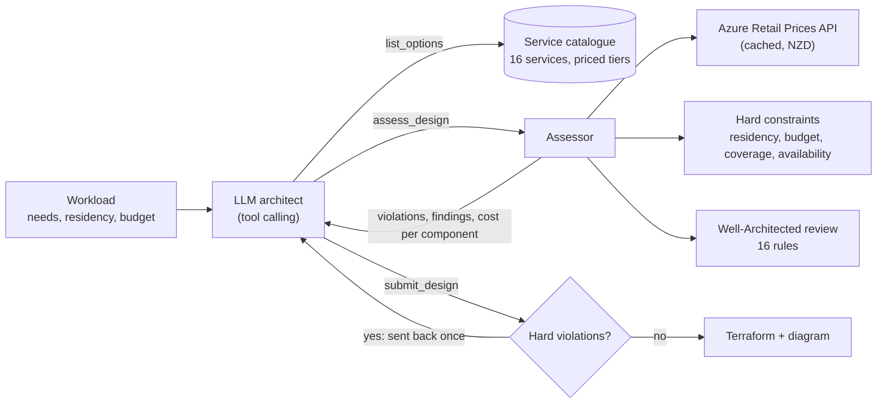

# Cloud Architect Agent

**An AI agent that designs Azure architectures for New Zealand organisations. It prices every draft live in NZD, enforces data residency, reviews the design against the Azure Well-Architected Framework, and writes Terraform that passes `terraform validate`.**

[](https://github.com/samiulhuda360/cloud-architect-agent/actions/workflows/ci.yml)


## Why this exists

Azure's New Zealand North region (Auckland) has three availability zones, but it differs from Sydney in ways that a general-purpose AI assistant gets wrong from memory:

- **No Azure OpenAI.** In the Azure Retail Prices API (October 2026), Foundry Models (Azure OpenAI) has 0 price rows in New Zealand North and 833 in Australia East.
- **62 other services are missing too**, priced in Australia East but not in NZ North. They include Azure Machine Learning, Databricks, Data Factory, Synapse, IoT Hub, Bot Service and Sentinel ([snapshot](docs/data/region-services-2026-10.json)).
- **No paired region**, so geo-redundant storage (GRS) is not offered, and a disaster-recovery site has to leave the country.
- **No GPU virtual machines**, so self-hosting a model in Auckland is not an option either.
- **Prices differ**: most compute costs about 5% more than in Sydney, some SKUs much more, and a few are cheaper:

| Monthly list price (730 hours) | NZ North | Australia East | Difference |
|---|---|---|---|
| App Service P0v3 (Linux), 1 instance | NZ$162 | NZ$119 | **+37%** |
| App Service P1v3 (Linux), 1 instance | NZ$249 | NZ$237 | +5% |
| VM D2s v5 (Linux) | NZ$163 | NZ$155 | +5% |
| PostgreSQL Flexible D2ds v5 (compute) | NZ$330 | NZ$315 | +5% |
| Azure SQL General Purpose, 2 vCores (compute) | NZ$491 | NZ$467 | +5% |
| Azure Cache for Redis Standard C1 | NZ$178 | NZ$178 | 0% |
| Azure AI Search Basic | NZ$130 | NZ$172 | **-24%** |

*USD list prices from the Azure Retail Prices API, converted at Azure's own rate (US$1 = NZ$1.7667).*

So the agent never quotes a price or a region from memory. Every design goes through tools that check it against live data, and anything that crosses the residency boundary has to be recorded as an explicit exception.

## What it does

Describe a workload in business terms: what it does, users, peak requests per second, data size, LLM token volume, data residency (`nz`, `anz` or `any`), availability target, personal information and budget. You get back:

- **An architecture**, built only from a catalogue of 16 Azure services that each have exact price recipes.
- **A live monthly price in NZD for each component.** Tiered meters, free grants and platform minimums are applied. For example, zone-redundant App Service runs at least 2 instances, and zone-redundant Functions keeps 2 always-ready instances.
- **Hard-constraint checks.** A design fails if:
  - data leaves the residency boundary;
  - the AI deployment type processes prompts outside it;
  - it goes over budget;
  - a need is left uncovered;
  - it uses a service that isn't sold in the chosen region.
- **A Well-Architected review** of 16 rules across reliability, security, cost, operations, performance and residency, each with a severity and a fix. For example, a design that names a DR region but deploys no standby there is flagged.
- **Terraform for `azurerm` v4**, with:
  - zone redundancy;
  - private endpoints with private DNS;
  - App Service VNet integration;
  - Front Door with health-probe failover;
  - cross-region database replicas;
  - managed identities and Key Vault.
- **A Mermaid diagram** with one box per region. Anything outside the residency boundary is drawn in red.

It works three ways: a **web UI**, a **CLI**, and an **MCP server** that any MCP-capable AI assistant or IDE can call.


<details><summary>More screens: the live price breakdown, the review and the Terraform</summary>


</details>

## How the agent works



1. The model reads the catalogue and drafts a design.
2. Every draft goes through `assess_design`, which prices it, checks the hard constraints and runs the review.
3. The model fixes what fails and resubmits. A submission that still has violations is rejected once, with the reasons.
4. A constraint that genuinely can't be met inside the boundary must be recorded as an exception. The exception starts with the rule code, for example `[RES-REGION] no Azure model is sold in NZ North`. Nothing is relaxed silently, and the UI and report show every accepted exception.

The model is any OpenAI-compatible endpoint with tool calling: OpenRouter (default), OpenAI, Azure OpenAI, Ollama or vLLM. If no model is configured, or the model fails, a deterministic **rule-based architect** produces the design instead. The rule-based architect also serves as the evaluation baseline.

## Evaluation

20 New Zealand workloads live in [`eval/scenarios.yaml`](eval/scenarios.yaml). They include:
- a GP clinic portal and a council policy assistant
- an iwi land-records archive
- a bank chatbot with a 99.99% target
- a school newsletter app on a NZ$90 budget
- a farm sensor dashboard

The same deterministic assessor scores every design, whoever made it. Each run records five measures:

- **No silent violations:** no hard constraint is broken without an accepted exception.
- **Within budget.**
- **Scenario expectations met.** For example, health data stays in NZ North, or the critical bank workload has a working DR site.
- **High-severity findings left open.**
- **`terraform validate` passes** on the generated code.

| System | No silent violations | Within budget | Expectations met | High findings left (avg) | Terraform valid |
|---|---|---|---|---|---|
| Rule-based architect (no model) | 20/20 | 20/20 | 20/20 | 0.05 | 20/20 |

The one open high finding is deliberate. The government portal must keep data in New Zealand and needs 99.99% availability. New Zealand has one Azure region, so the design records the regional-outage risk instead of quietly placing a DR site in Australia.

The harness also runs the **LLM agent with tools** against the **same LLM without tools**, which gets the same rules and catalogue but estimates prices from memory. It records each model's own cost estimate next to the live price of its design. Run it with any model:

```bash
python -m cloud_architect eval                       # all three systems
python -m cloud_architect eval --only agent --resume # re-run only scenarios that hit a provider error
```

Rate limits and timeouts are retried with back-off, and `--resume` re-runs only infrastructure failures, never a bad answer. Results go to [`eval/results.md`](eval/results.md).

## Quick start

```bash
git clone https://github.com/samiulhuda360/cloud-architect-agent
cd cloud-architect-agent
python -m venv .venv && source .venv/bin/activate   # Windows: .venv\Scripts\activate
pip install -e ".[dev]"

python -m cloud_architect serve                      # http://127.0.0.1:8000
```

The rule-based mode needs no API key: prices come from the public Azure Retail Prices API and are cached for a week in `cache/prices.sqlite`. For the AI agent, copy `.env.example` to `.env` and add a key.

From the command line:

```bash
python -m cloud_architect design examples/gp-clinic.yaml --terraform build/gp-clinic
cd build/gp-clinic && terraform init && terraform plan -var subscription_id=<subscription-id> -var db_admin_password=<password>
```

### As an MCP server

`python -m cloud_architect mcp` starts a stdio MCP server with these tools:
- `list_services`
- `check_region` (is a service sold in a region, at what price)
- `assess_design`
- `rule_based_design`
- `terraform_for`

Register it in any MCP client:

```json
{
  "mcpServers": {
    "cloud-architect": {
      "command": "python",
      "args": ["-m", "cloud_architect", "mcp"],
      "cwd": "/path/to/cloud-architect-agent"
    }
  }
}
```

## What the tests caught

The test suite checks the pricing against live data, not just the code paths. Building it surfaced four real bugs, and each now has a test:

- **One meter name, ten prices.** Azure lists every PostgreSQL General Purpose size as its own SKU ("2 vCore", "4 vCore", … "96 vCore"), and all of them share the meter name `vCore`. A recipe that matched on the meter name alone picked up all ten rows and used whichever came last. In Sydney that was the 32-vCore server: NZ$10,070 a month instead of NZ$315. Now every recipe must resolve to exactly one price per volume band, offline in CI and weekly against the live API.
- **A free grant counted twice.** Australia East publishes the Functions free grant as a $0 price band, and NZ North doesn't. The grant is now applied once in both regions.
- **Platform minimums.** Zone-redundant Flex Consumption keeps two always-ready instances that are billed continuously, about NZ$93 a month, according to [Microsoft's reliability guide](https://learn.microsoft.com/azure/reliability/reliability-functions). Pricing and the review both account for it.
- **Paper DR.** A design could pass by naming a DR region with nothing deployed in it. The review now requires standby compute and a copy of the data there, and the rule-based architect builds a warm standby with replicas and Front Door failover.

The suite runs offline against 147 real price rows captured from the API. With Terraform installed, it also runs `terraform validate` and a `terraform fmt` round-trip on all 20 scenario designs. A 75-resource configuration that uses every template also validates.

## Project layout

```
cloud_architect/
  pricing.py     Azure Retail Prices API client: paging, retries, SQLite cache, tiered meters, USD→NZD
  catalogue.py   16 services, their tiers and exact price recipes (meters + quantity formulas)
  assess.py      pricing, hard constraints and the Well-Architected review (deterministic)
  rules.py       the rule-based architect, with budget-driven downsizing
  agent.py       the tool-calling agent and the no-tools baseline
  terraform.py   Terraform generation (azurerm v4), fmt-aligned
  diagram.py     Mermaid diagrams with residency boundaries
  evaluate.py    the evaluation harness
  api.py, mcp_server.py, __main__.py   web API, MCP server, CLI
ui/index.html    single-page UI
eval/            scenarios and results
tests/           93 tests; offline price fixture; live checks behind LIVE_PRICES=1
```

More detail is in [docs/architecture.md](docs/architecture.md).

## Limitations

- **List prices.** Reservations, savings plans and enterprise or CSP discounts are not applied (the review flags where a reservation would pay off). Requests, egress and log volume are estimated from peak requests per second.
- **A curated catalogue.** It has 16 services and their common tiers, not every Azure SKU.
- **Terraform is validated, not deployed, in CI.** It is a reviewed starting point. It doesn't include:
  - a remote state backend;
  - application code or deployment pipelines;
  - TLS certificates (the App Gateway listener stays HTTP until you add one).
- **Residency means where resources run.** It does not cover Microsoft support access, telemetry, or global control-plane services such as Entra ID. Treat this as an aid to a privacy review, not a replacement for one.

## Roadmap

- Reserved-instance and savings-plan pricing, so on-demand and 3-year costs can be compared.
- More services: Service Bus, API Management, Event Hubs, Azure Container Registry.
- Bicep output alongside Terraform.
- A pull-request reviewer that runs the assessor against `terraform plan` output.

## Licence

MIT. Prices come from Microsoft's public Azure Retail Prices API. This project is not affiliated with Microsoft.
