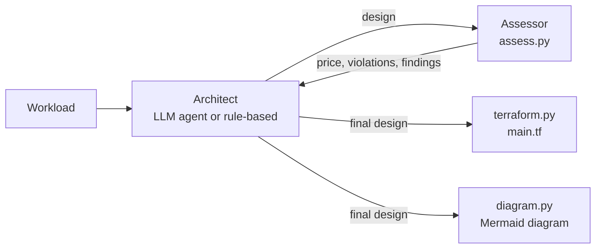

# How Cloud Architect Agent works

This is the reference for anyone reviewing or extending the code. The README covers what the project does and why.

## 1. Pricing (`pricing.py`, `catalogue.py`)

**Source.** The [Azure Retail Prices API](https://learn.microsoft.com/rest/api/cost-management/retail-prices/azure-retail-prices) is public, so no Azure account is needed.

**Queries.** The client queries by `serviceName`, `armRegionName` and `priceType eq 'Consumption'`. It does three things:

- follows `NextPageLink`;
- retries a failed request (for example `429` or `5xx`) up to three times, with back-off;
- caches each query in SQLite (`cache/prices.sqlite`) for a week.

**Currency.** Prices are fetched in USD and converted at Azure's own rate. The NZD prices the API returns are rounded to four decimal places, which turns per-second meters such as Container Apps and Functions into zero. So the rate is derived once, from a reference SKU that Azure prices in both currencies: Linux D2s v5 in Australia East. That gives US$1 = NZ$1.7667.

**Recipes.** Each service tier in the catalogue is a list of `Usage` recipes. A recipe has:

| Field | Meaning |
|---|---|
| `match` | exact product, SKU, meter and (for global services) pricing zone |
| `quantity(component, workload)` | monthly units: hours, GB-months, 10K requests, GB-seconds, … |
| `free` | a monthly free grant, subtracted once (see below) |
| `service`, `extra`, `region` | price from another API service or a fixed zone (e.g. AKS nodes are Virtual Machines; Front Door is priced per zone) |

**Tiered meters.** `tiered_cost` applies each volume band in turn (for example, Log Analytics' first 5 GB free). Identical duplicate rows, which Azure sometimes publishes, are collapsed.

**Free grants.** Some regions publish a grant as a $0 first band and others don't. If a $0 band is present, the recipe's `free` value is not subtracted again.

**Platform minimums.** `billed_instances()` applies the floor Azure enforces once zone redundancy is on:
- **App Service** runs at least 2 instances.
- **Flex Consumption Functions** keeps 2 always-ready instances. They are billed on the baseline meter around the clock, and executions are billed on the always-ready meters.

**One price per band.** Every recipe must resolve to exactly one price per volume band, and `catalogue.ambiguous_recipes()` enforces this. It runs offline in the test suite, and weekly in CI against the live API (`LIVE_PRICES=1`).

This matters because Azure lists each PostgreSQL General Purpose size (`2 vCore`, `4 vCore`, … `96 vCore`) as its own SKU, under one meter name, `vCore`. A recipe therefore has to match the SKU as well as the meter.

**Normalisation.** Names are normalised before anything is judged, so a design is assessed on its choices and not its spelling:
- regions: `New Zealand North` → `newzealandnorth`
- services: `App Service` → `app_service`
- tiers: `p1 v3` → `P1v3`

## 2. Assessment (`assess.py`)

The assessor is deterministic: the same design, workload and prices always get the same verdict. It judges the agent, the baseline and the rule-based architect alike.

### Hard constraints (violations)

**Residency and budget violations can be accepted.** An entry in `accepted_exceptions` must name the rule code (for example `"[RES-REGION] …"`) or the thing it relaxes. The violation then becomes a high-severity finding marked `Accepted:`.

**Coverage violations cannot be accepted.** These are `UNKNOWN`, `REGION`, `NOT-SOLD` and `NEED`.

Accepted exceptions are always reported.

| Code | Pillar | Fails when |
|---|---|---|
| `UNKNOWN` | coverage | the service or tier is not in the catalogue |
| `REGION` | coverage | the region is not one of the five supported |
| `NOT-SOLD` | coverage | Azure has no price for that service in that region |
| `NEED` | coverage | a workload need (web app, SQL, LLM, …) is not covered by any component |
| `RES-REGION` | residency | a regional component sits outside the residency boundary |
| `RES-AI-GLOBAL` | residency | an AI deployment is *Global* while residency is not `any`, or the workload has personal data |
| `RES-AI-ZONE` | residency | an AI deployment is *Data Zone* under `nz` residency. Under `anz` or `any` it is a medium finding instead. |
| `RES-DR` | residency | the DR region is outside the residency boundary |
| `BUDGET` | cost | the monthly total is over budget |

### Well-Architected review (findings)

The availability rules apply to production workloads. `high` and `critical` are the 99.95% and 99.99% targets.

| Code | Severity | Flags |
|---|---|---|
| `REL-ZONES` | high | high or critical availability, but compute is not zone-redundant with at least 2 billed instances (the DR standby is exempt) |
| `REL-DB-HA` | high | high or critical availability, but the PostgreSQL or Azure SQL database has no zone-redundant standby (replicas are exempt) |
| `REL-DR` | high | critical availability with no DR region, or a DR region with no standby compute or no copy of the database |
| `REL-ZR-TIER` | high | zone redundancy requested on a tier that doesn't support it |
| `REL-FAILOVER` | medium | a working DR site but no Front Door, so failover is a manual DNS change |
| `REL-STORAGE` | medium | locally redundant storage under high availability |
| `REL-TIER` | medium | a dev or test tier in production |
| `SEC-PRIVATE` | high | personal data in a store that is reachable from the internet |
| `SEC-SECRETS` | high | no Key Vault |
| `SEC-WAF` | medium | a public web app with personal data and no WAF (Application Gateway WAF v2 or Front Door Premium) |
| `OPS-LOGS` | medium | no Log Analytics workspace |
| `PERF-CACHE` | medium | more than 50 requests/s at peak on a relational database with no cache |
| `PERF-EDGE` | low | more than 50,000 users, residency `any`, and no edge network |
| `COST-DEV` | medium | a production tier in a dev environment |
| `COST-RESERVE` | info | steady compute that a reservation would make cheaper |
| `RES-EDGE` | medium | a global edge service under `nz` or `anz` residency |

## 3. The architects

### Rule-based (`rules.py`)

Fixed rules encode common practice:
- the primary region is New Zealand North, which every residency setting allows;
- zone redundancy for high availability;
- private endpoints for personal data;
- Key Vault and Log Analytics always;
- a language model in Australia East. It uses a Data Zone deployment unless residency is `any` and there is no personal data. Under `nz` residency an exception is recorded;
- for critical workloads, a warm standby in the DR region (inside the residency boundary) with database replicas and Front Door. Front Door is Premium with WAF when the app handles personal data.

The design is then downsized tier by tier until it fits the budget, and each step is recorded in `tradeoffs`.

### LLM agent (`agent.py`)

The agent is an OpenAI-compatible tool-calling loop (at most 12 steps) with three tools:

| Tool | Returns |
|---|---|
| `list_options(role?)` | the catalogue: services, tiers, zone-redundancy support, notes and residency notes |
| `assess_design(design)` | total and per-component NZD, violations with fixes, high findings, other findings |
| `submit_design(design)` | accepts the design, or rejects it once if hard violations remain |

The system prompt tells the model to:
1. price and check every draft with `assess_design`, and never state a price that didn't come from it;
2. fix every hard violation, and keep within the budget;
3. respect residency, and record an exception only when no compliant option exists, starting it with the rule code;
4. address high-severity findings unless that breaks the budget, and say so in `tradeoffs`;
5. give every component a one-line purpose, keep the rationale short, and finish by calling `submit_design`.

Rate limits, timeouts and `5xx` errors are retried with back-off (15, 30, 60 and 120 seconds). A daily quota error fails fast instead.

### LLM without tools (the baseline)

The baseline gets the same rules, region codes, allowed regions and full catalogue (with its notes) as the agent, but no tools. It must estimate the price from its own knowledge.

An unparseable reply gets one repair turn, which is the same allowance the agent gets for a rejected submission. So the only difference between the two systems is the tools.

## 4. Evaluation (`evaluate.py`)

There are 20 scenarios in `eval/scenarios.yaml`, and each can list expectations:

| Expectation | Meaning |
|---|---|
| `max_total` | total is at most this amount |
| `all_in` | named regions only |
| `private_data` | every data store behind a private endpoint |
| `zone_redundant_db` | the database is zone-redundant |
| `has` | the design includes these services |
| `no_tier` | the design avoids these tiers |
| `llm_exception` | an exception is recorded for the LLM |
| `dr_region` | a working DR site exists: standby compute and a database copy |
| `dr_note` | the single-region risk is recorded |

Each design is scored on:
- silent violations;
- staying within budget;
- expectations met;
- high findings left open;
- `terraform validate`;
- for the baseline, how far its own cost estimate is from the live price of its design.

`terraform validate` runs when Terraform is on the `PATH` or `TERRAFORM` is set, and `--no-terraform` skips it. `--resume` re-runs only the scenarios that failed with a provider error. A scenario where the model answered is never re-run.

## 5. Terraform (`terraform.py`)

**Scope.** One resource group, with a random suffix for globally unique names. Secrets come in as variables.

**Networking.** Each region gets a virtual network only if it needs one, with only the subnets it needs:

| Subnet | Address range | Used for |
|---|---|---|
| private endpoints | `.1.0/24` | private endpoints |
| workloads | `.2.0/24` | VMs |
| gateway | `.3.0/24` | Application Gateway |
| container apps | `.4.0/23` | zone-redundant Container Apps environment |
| app integration | `.6.0/24` | App Service VNet integration, delegated to `Microsoft.Web/serverFarms` |

**Private endpoints.** Each one registers in a private DNS zone (`privatelink.postgres.database.azure.com`, …). The zone is linked to every virtual network. App Service apps join the network through VNet integration, so they can resolve and reach their data.

**Disaster recovery:**
- PostgreSQL replicas use `create_mode = "Replica"`.
- Azure SQL replicas are geo-secondaries (`create_mode = "Secondary"`).
- A Cosmos DB replica becomes a second `geo_location` on the same account, with automatic failover.
- Front Door gets one origin per web app: priority 1 in the primary region and priority 2 in the DR region. A health probe and an HTTPS route connect them. Premium adds a WAF policy with the Microsoft Default and Bot Manager rule sets.

**No keys.** Apps use managed identities. Functions reach their storage with a system-assigned identity and two role assignments: Storage Blob Data Owner and Storage Queue Data Contributor. No storage key or connection string appears in the code, and a test fails if `access_key` appears in the Terraform for any of the 20 scenarios.

**Formatting.** `_fmt` aligns attributes the way `terraform fmt` does. When Terraform is installed (CI installs it), the tests run two checks:
- a `terraform fmt` round-trip on all 20 scenario designs;
- `terraform validate` on a critical multi-region design.

The evaluation harness also runs `terraform validate` on every design it scores.
